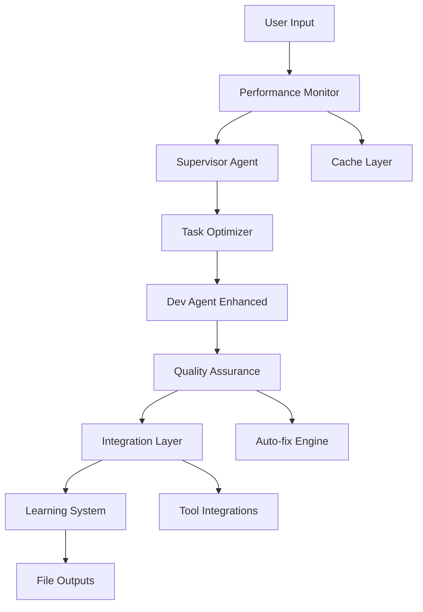

# Agent Workflow Optimization Design

**Spec**: `.specs/features/agent-workflow-optimization/spec.md`
**Status**: Draft

---

## Architecture Overview

A otimização será implementada como uma camada de melhorias sobre a arquitetura existente, mantendo a estrutura supervisor + dev agent intacta. As melhorias serão distribuídas em módulos especializados que interceptam e aprimoram diferentes pontos do workflow.



**Princípios de Design:**
- **Não disruptivo**: Melhorias são opt-in e não quebram workflow existente
- **Modular**: Cada melhoria pode ser ativada/desativada independentemente
- **Medível**: Todas as melhorias incluem métricas de performance
- **Fallback**: Se melhoria falhar, volta ao comportamento padrão

---

## Code Reuse Analysis

### Existing Components to Leverage

| Component            | Location            | How to Use                |
| -------------------- | ------------------- | ------------------------- |
| StateGraph           | `src/agent/graph.ts`| Extender com nós de otimização |
| Tool System          | `src/tools/filesystem.ts` | Adicionar ferramentas de qualidade |
| State Management     | `src/agent/state.ts`| Incluir métricas de performance |
| Zod Validation       | `src/tools/filesystem.ts` | Reutilizar para validação de código |

### Integration Points

| System         | Integration Method                      |
| -------------- | --------------------------------------- |
| LangGraph      | Extensões nos nós do StateGraph         |
| File System    | Hooks de pré/post processamento         |
| Testing        | Integração com Jest existente           |
| Build Tools    | Scripts de lint/format automáticos      |

---

## Components

### Performance Monitor

- **Purpose**: Monitora e otimiza velocidade de execução de tarefas
- **Location**: `src/agent/performance-monitor.ts`
- **Interfaces**:
  - `startTask(taskId: string): void` - Inicia monitoramento
  - `endTask(taskId: string): PerformanceMetrics` - Finaliza e retorna métricas
  - `optimizeParallel(tasks: Task[]): Task[][]` - Agrupa tarefas para paralelização
- **Dependencies**: State management, timer utilities

### Task Optimizer

- **Purpose**: Otimiza decomposição e execução de tarefas complexas
- **Location**: `src/agent/task-optimizer.ts`
- **Interfaces**:
  - `decomposeComplex(task: string): Task[]` - Quebra tarefas complexas
  - `prioritizeTasks(tasks: Task[]): Task[]` - Ordena por dependências
  - `cacheSimilarTasks(task: Task): boolean` - Cache de tarefas similares
- **Dependencies**: Supervisor agent, cache system

### Quality Assurance Engine

- **Purpose**: Garante qualidade consistente do código gerado
- **Location**: `src/tools/quality-assurance.ts`
- **Interfaces**:
  - `validateCode(code: string, language: string): QualityReport` - Valida código
  - `autoFixIssues(code: string, issues: Issue[]): string` - Corrige automaticamente
  - `generateTests(code: string): string[]` - Gera testes unitários
- **Dependencies**: ESLint, Prettier, Jest

### Integration Layer

- **Purpose**: Integra com ferramentas de desenvolvimento externas
- **Location**: `src/tools/integration-layer.ts`
- **Interfaces**:
  - `runLinter(filePath: string): LintResult` - Executa lint automático
  - `formatCode(code: string): string` - Formata código
  - `runTests(): TestResult` - Executa testes e analisa falhas
  - `buildProject(): BuildResult` - Executa build e identifica erros
- **Dependencies**: Child process, file system tools

### Learning System

- **Purpose**: Sistema de aprendizado contínuo baseado em feedback
- **Location**: `src/agent/learning-system.ts`
- **Interfaces**:
  - `recordSuccess(task: Task, metrics: PerformanceMetrics): void` - Registra sucesso
  - `recordFailure(task: Task, error: Error): void` - Registra falha
  - `getInsights(): LearningInsights` - Fornece insights aprendidos
  - `adaptStrategy(task: Task): TaskStrategy` - Adapta estratégia baseada em aprendizado
- **Dependencies**: File storage, pattern matching

### Cache Layer

- **Purpose**: Cache inteligente para acelerar execuções repetitivas
- **Location**: `src/utils/cache.ts`
- **Interfaces**:
  - `getCachedResult(key: string): any` - Recupera resultado em cache
  - `setCachedResult(key: string, value: any, ttl: number): void` - Armazena em cache
  - `invalidatePattern(pattern: string): void` - Invalida cache por padrão
- **Dependencies**: File system, hash utilities

---

## Data Models

### PerformanceMetrics

```typescript
interface PerformanceMetrics {
  taskId: string;
  startTime: Date;
  endTime: Date;
  duration: number;
  success: boolean;
  errorCount: number;
  toolCalls: number;
  tokensUsed: number;
}
```

### QualityReport

```typescript
interface QualityReport {
  score: number; // 0-100
  issues: CodeIssue[];
  suggestions: string[];
  autoFixable: boolean;
}

interface CodeIssue {
  type: 'error' | 'warning' | 'style';
  message: string;
  line: number;
  column: number;
  rule: string;
}
```

### LearningInsights

```typescript
interface LearningInsights {
  successfulPatterns: Pattern[];
  failurePatterns: Pattern[];
  performanceTrends: Trend[];
  recommendations: string[];
}

interface Pattern {
  description: string;
  frequency: number;
  successRate: number;
  avgDuration: number;
}
```

---

## Implementation Strategy

### Phase 1: Core Infrastructure (P1)
- Performance Monitor + Cache Layer
- Task Optimizer básico
- Métricas de baseline

### Phase 2: Quality Assurance (P2)
- Quality Assurance Engine
- Auto-fix capabilities
- Test generation

### Phase 3: Intelligence (P3)
- Task decomposition avançada
- Research automation
- Context-aware decisions

### Phase 4: Integration (P4)
- Tool integrations
- Build pipeline hooks
- Development workflow

### Phase 5: Learning (P5)
- Learning System
- Pattern recognition
- Continuous improvement

---

## Risk Mitigation

### Performance Impact
- **Risk**: Otimizações podem adicionar overhead
- **Mitigation**: Métricas constantes, circuit breakers, feature flags

### Quality Degradation
- **Risk**: Auto-fix pode introduzir bugs
- **Mitigation**: Fallback para modo manual, validação rigorosa

### Complexity Overload
- **Risk**: Muitas features simultâneas complicam debugging
- **Mitigation**: Modular design, logging detalhado, testes isolados

---

## Success Metrics

- **Velocidade**: Redução de 50% no tempo de tarefas simples
- **Qualidade**: Aumento de 80% na taxa de aprovação de código
- **Inteligência**: Redução de 60% em intervenção manual para problemas complexos
- **Integração**: 100% das ferramentas de desenvolvimento integradas
- **Aprendizado**: Melhoria de 30% na performance após 100 tarefas
